# Dokumentation Teslabot
## Ideensammlung
Wir wollten von Beginn an einen Chatbot bauen, der einen realen Nutzen hat und ein Thema wählen, das uns alle interessiert und auch so gezielt unser Wissen einsetzen können. Schnell kam die Idee auf einen Chatbot bezüglich Autos zu bauen, insbesondere mit Fokus auf die Modellberatung. Wir wollten es Kunden erleichtern ein passendes Auto zu finden, dies über einen Chatbot, der nicht nur vordefinierte Antworten hat, sondern auch wirklich in der Praxis genutzt werden kann. 

Ursprünglich begannen wir eine Grundlage mit Personas und möglichen Dialogen für die Automarke Audi zu gestalten. Relativ schnell wurde uns allerdings klar, dass es schwierig werden könnte die gesamte Anzahl von Modellen und Varianten die Audi anbietet abzudecken ohne dass die Qualität darunter leidet. 

Deshalb entschieden wir uns dazu, nochmals neu zu beginnen und eine andere Marke zu suchen. Relativ schnell entschieden wir uns für Tesla, da die Modellvielfalt auf 4 Modelle beschränkt ist und wir noch keinen Chatbot auf der Website finden konnten, wo wirklich mit einem LLM etc. kommuniziert werden konnte, es gibt nur einen Chat, wo man direkt mit einem echten Menschen verbunden wird.

Nun war die Frage, welche Fähigkeiten unser Chatbot besitzen sollte, wir definierten von Anfang an Mindestanforderungen, die er auf jeden Fall gut beherrscht, uns war es wichtiger eine hohe Qualität zu gewährleisten mit sauberen Workflows anstelle von einem riesigen Chatbot der alles kann, aber noch nichts so richtig. Folgende zwei Use-Cases definierten wir als MVP, also als das Minimum, welches wir umsetzten wollten:
- Modellberatung, welches Modell passt zum Kunden
- Spezifische Fragen zu Modellen stellen können

Wir glauben, dass genau diese Art von Kundenanfragen den Mitarbeitern sehr viel Zeit ersparen können, da sie sehr häufig vorkommen und eigentlich relativ einfach durch einen Chatbot übernommen werden können. Das Wichtigste ist allerdings für uns, dass unser Chatbot wirklich einen Mehrwert bietet, wir alle fanden einen Konsens darüber, dass wir selber schon sehr oft genervt wurden von Chatbots die kaum Funktionalität hatten und die Funktionalität, die vorhanden war, führte einfach zu einem Ticket oder man fiel in eine Warteschlange um auf einen Menschen zu warten. 

## Erstellung der Conversational Design Canvas
Bei der Erstellung der Conversational Design Canvas war es uns besonders wichtig mit realistichen Personas und Dialogen zu arbeiten, um diese später auch wirklich nutzen zu können. 

Wir merkten aber auch schnell, dass es uns schwierig fiel einfach Dialoge zu schreiben ohne zu wissen wie es in der Praxis aussieht, weshalb wir vorerst nur eine mögliche Konversation und Persona erstellten. 

Bevor wir weitere Personas und Dialoge erstellen wollten, machten wir uns also daran diesen einen Dialog in Voiceflow umzusetzen und entschieden uns dann im Laufe des Projektes dazu die möglichen Dialoge für die Personas am Ende zu definieren, da wir die möglichen Dialoge oft zuerst in Voiceflow modellierten um neue Funktionen etc. zu testen. 

## Dokumentation der einzelnen Workflows in Voiceflow
Wir haben uns dazu entschieden die Kunden überall mit "Du" anzusprechen, da Teslas als dynamisches Unternehmen gilt und aus eigener Erfahrung wird man in den Stores in der Regel mit "Du" angesprochen. 

Insgesamt gibt es 6 Workflows, die wir erstellt haben:
- Start - Hier sind die Funktionen des Bots ersichtlich
- Kauf - Hier kann direkt ein Tesla gekauft werden
- Modellberatung - Hier kann ein passendes Modell ermittelt werden
- Probefahrt - Hier kann eine Probefahrt gebucht werden
- Spezifische Fragen zu Modellen - Hier können Fragen zu Modellen beantwortet werden
- Supportanfrage zu Mensch - Hier kann eine Supportanfrage an Menschen gestellt werden

### Workflow Start
Dieser Workflow ist bewusst sehr klein gehalten, er soll den Kunden zeigen, was der Chatbot kann. Bei der Nutzung dieses Workflows kann einfach direkt in das Fenster geschrieben werden, was man tun möchte und man wird mit dem entsprechenden Intent weitergeleitet, alternativ kann von den Buttons gewählt werden, was man tun möchte um weitergeleitet zu werden. 

Wir haben uns hier bewusst dagegen entschieden nur auf eine Textantwort des Kunden zu setzen um mit den Buttons auch zu zeigen, was der Bot alles kann. 

### Workflow Kauf

Dieser Workflow ermöglicht direkt den Kauf eines Teslas mit entsprechender Ausstattung, bei Abschluss des Workflows wird eine Bestätigungnsmail versendet. 

Ablauf: 
1. Selbstverständlich gibt es einen Intent, dieser ist darauf ausgelegt zu erkennen, wenn der Kunde erwähnt, dass er ein Auto kaufen möchte. 
2. Es wird geprüft ob der Kunde in der Modellberatung schon ein passendes Modell gefunden hat, sollte dies der Fall sein, wird er gefragt ob er dieses Auto kaufen möchte. Es wurde bewusst darauf verzichtet, dass immer angenommen wird, dass dieses Auto gekauft werden möchte, so kann die Kundschaft flexibel entscheiden welches Auto gekauft werden soll. Wenn noch kein passendes Modell definiert wurde oder die Kundschaft nicht das Auto kaufen möchte, dass bei der Modellberatung ermittelt wure, dann wird explizit nachgefragt, welches gekauft werden möchte. 
3. Sobald validiert wurde, welches Auto gekauft werden möchte, folgt die Frage nach der Variante. Dies wurde bewusst über Buttons gelöst um der Kundschaft alle Optionen transparent aufzuzeigen und eine zu 100% saubere Auswahl zu ermöglichen. 
4. Nach Auswahl des Modelles stellt sich die Frage nach der Farbe des Autos und der Innenraumfarbe. Da jedes Modell unterschiedliche Farben hat, stellte sich die Frage, wie sichergestellt werde konnte, dass nur wirklich vorhanden Farben gewählt werden können. Einerseits hätte dies wieder über Buttons gelöst werden können, allerdings entschieden wir uns hier dagegen, um die Komplexität zu reduzieren und neue technische Funktionen zu integrieren. Es wurden zwei Entities Farbe und Innenraumfarbe definiert, mit den möglichen Werten für alle Modelle. Um sicherzustellen, dass für das Modell, das gekauft wird, auch eine Farbe gewählt wird, die existiert, wurden Regeln definiert: 
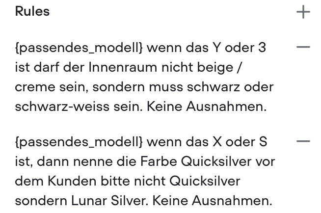
Ein Vorteil mit dieser Lösung ist auch, dass die Kundschaft explizit nachfragen kann, welche Farben verfügbar sind und dies dann sofort für das aktuelle Modell beantwortet wird:
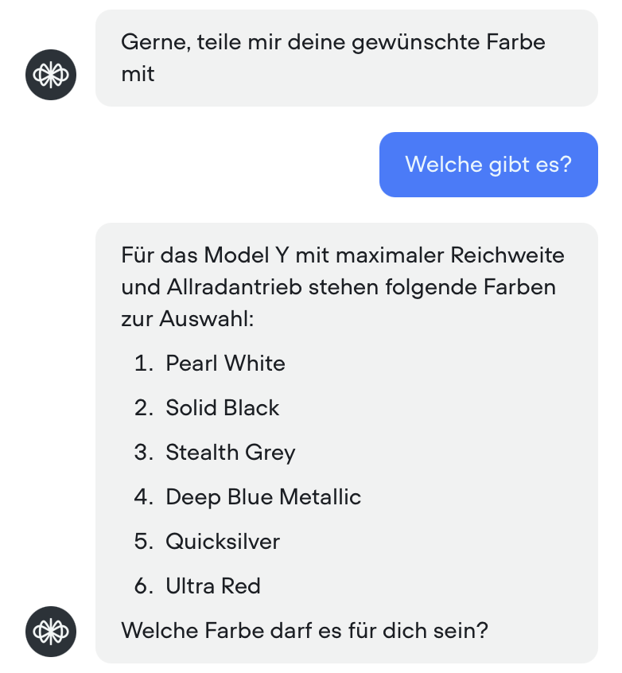
Ein weiterer Vorteil dieses Steps ist, dass der Workflow erst weitergeht, sobald alle Informationen zu den Farben bekannt sind, wenn der Kunde sagt "Ich weiss nicht welche Farbe" geht der Workflow nicht weiter, sondern der Bot probiert zu helfen, solange bis eine Farbe gewählt wurde. 
5. Nach Festlegung der Farbe wird nun nach den persönlichen Angaben des Kunden gefragt. Auch hier wurden wie im 4. Schritt wieder Entities angelegt, speziell ist hier allerdings, dass es keine vordefinierten Values gibt, da Name, Telefonnummer etc. immer individuell sind. Es wurde jedoch festgelegt, was für ein Data Type erwartet wird, dies ermöglicht es dem Modell besser zu verstehen, welche Values erwartbar sind. Um eine hohe Datenqualität sicherzustellen wurden allerdings noch drei Regeln definiert:
    - Eine E-Mail muss ein „@“ enthalten, jede E-Mail hat ein @, dies hilft bei der sauberen Erkennung der E-Mail
    - Der Wohnort / PLZ muss in der Schweiz sein, unser Chatbot ist auf die Schweizer Kundschaft  ausgelegt
    - Es wurde ein Maximalwert für die PLZ festgelegt, um die Datenqualität zu erhöhen
6. Es wird gefragt ob die Angaben der Kundschaft korrekt sind, dabei werden die Entities die in Schritt 5 gesetzt wurden angezeigt. Sollten die Angaben nicht korrekt sind, so wird gefragt, welcher Teil nicht korrekt sei, dieser kann dann erneut angepasst werden.
7. Wenn alle Angaben korrekt sind, werden alle Entities / Variablen die gesetzt wurden im Lauf des Workflows Chat mit einem Hook an make.com übergeben. Dort wird eine HTML E-Mail an die angegebene E-Mail versendet, mit den Details zum Modell und einem Button "Kontakt aufnehmen", falls etwas nicht in Ordnung wäre. Die Mails werden von einer persönlichen E-Mail Adresse versendet, hier gäbe es auch Alternativen, die sich umsetzten lassen. Zuletzt werden alle Angaben der Kundschaft in ein Google Sheets File gespeichert um eine Übersicht über die Bestellungen zu haben.
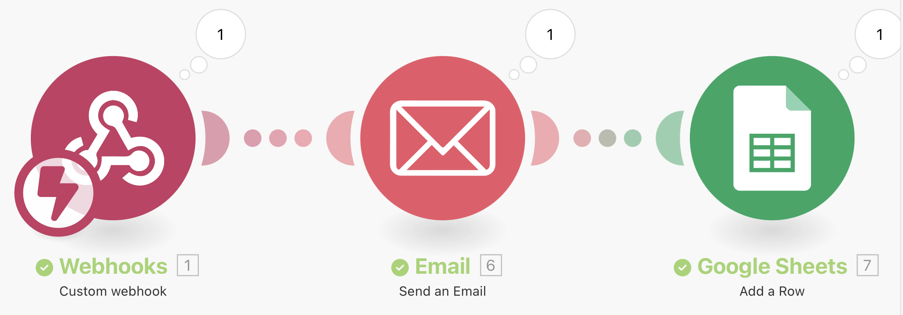
Auszug aus Google Sheets File:
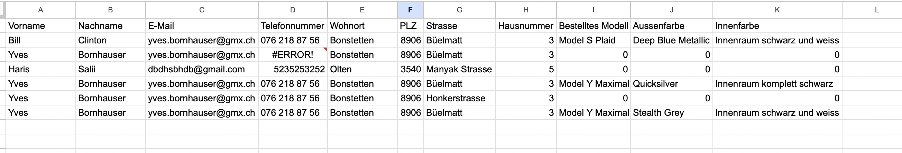
Beispielhafte Mail:
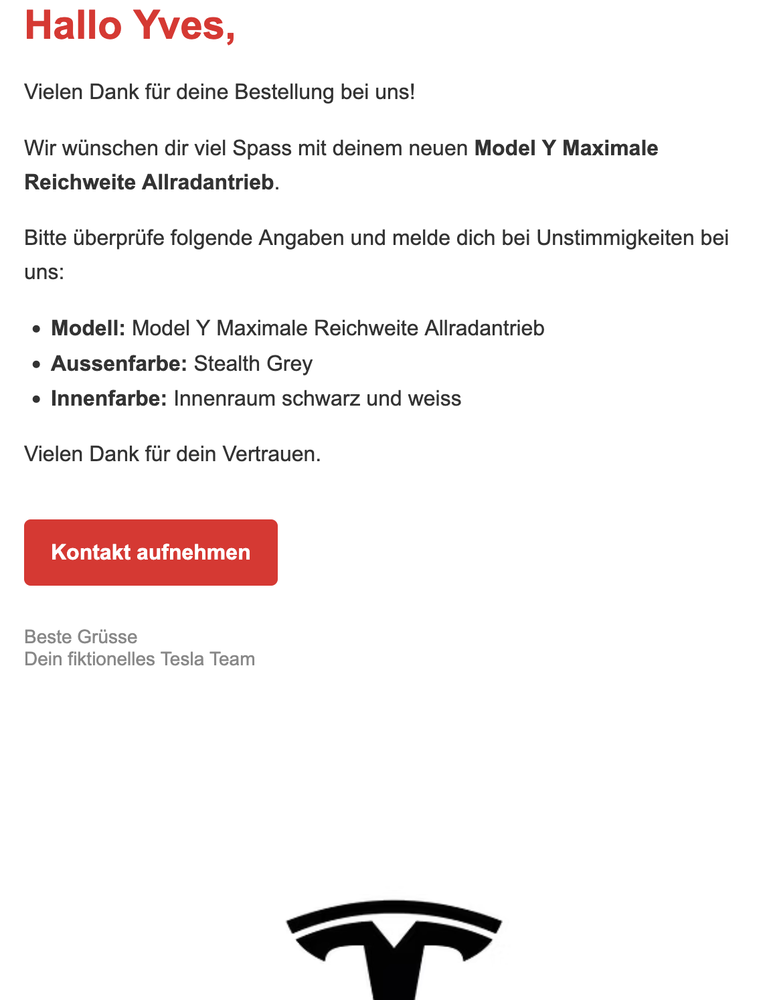

### Workflow Modellberatung

Dieser Workflow ermöglicht es der Kundschaft ein passendes Modell zu ermitteln. 

Ablauf:
1. Auch hier gibt es einen Intent, der prüft ob die Kundschaft irgendwo erwähnt, ob sie eine Modellberatung wünscht. 
2. Es wird entschieden, ob die Kundschaft lieber schreiben möchte, was ihnen wichtig ist, oder ob ihnen Fragen gestellt werden sollen. 
3. Wenn gewählt wurde, dass der Kundschaft Fragen gestellt werden sollen, wird anhand der Anzahl zu transportierenden Personen und der Wichtigkeit von Features entschieden, welches Auto zur Kundschaft passt, dieser Workflow könnte noch deutlich ausgebaut werden um genauere Vorschläge zu liefern, allerdings wurde hier darauf verzichtet um den Chatbot möglichst schnell zu gestalten. 
4. Wenn gewählt wurde, dass man selber beschreiben möchte, was man sucht, so kann man einfach dem Chatbot als Freitext schreiben, was einem wichtig ist, dabei analysiert ein LLM, welches Modell am besten passt, sollten die Angaben der Kundschaft für einen guten Vorschlag nicht reichen, so wird die Kundschaft aufgefordert nochmals detaillierter die Vorstellungen mitzuteilen. Hier wurde bewusst auf ein kleines LLM - 4o-mini von OpenAI gesetzt. Auf die Anwendung eines grossen LLM wurde verzichtet, da in der Regel die Beschreibung der Kunden sehr kurz ausfällt und dies keine komplexe Aufgabe ist. Zusätzlich wurde noch einige Beispiele für das Modell hinzugefügt um Few-Shot Learning zu nutzen bzw. um bessere / konsistente Antworten zu ermöglichen. Es gibt 6 If Bedingungen nach der Antwort durch das Modell, diese prüfen, welches Modell das LLM ermittelt hat, dieses soll gemäss den Instruktionen immer explizit das Modell erwähnen. Sollte es weder erwähnen, dass es zu wenig Informationen hat, noch dass ein passendes Modell gefunden wurde, so wird die Kundschaft aufgefordert erneut zu beschreiben, was ihnen wichtig ist. Dies wurde vorgenommen um alle möglichen Outputs zu modellieren.
5. Nachdem entweder durch die Fragen oder das LLM ein passendes Modell ermittelt wurde sieht die Kundschaft ein Bild mit dem passenden Modell und erhält gleich weitere Möglichkeiten um Fragen zu diesem Modell zu stellen, eine Probefahrt zu vereinbaren oder das Modell zu kaufen. Bei einer Wahl wird die Kundschaft auch gleich zum entsprechenden Workflow weitergeleitet. So möchten wir einen möglichst flüssigen Dialog ermöglichen und das volle Potenzial des Chatbots ausschöpfen und im Optimfall sogar die Anzahl Verkäufe erhöhen.

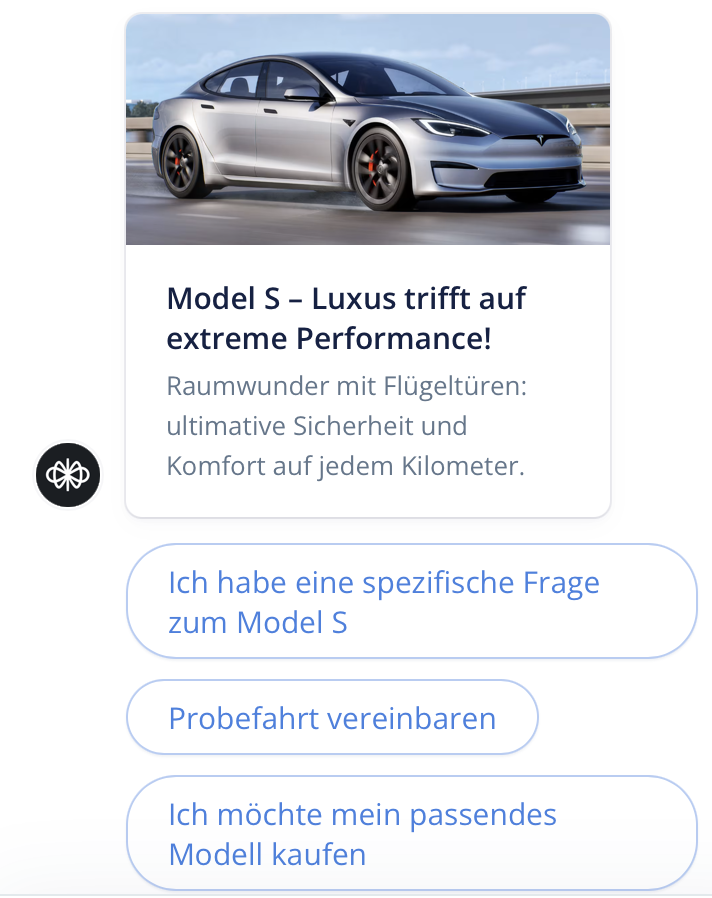

### Workflow Probefahrt

In diesem Workflow kann direkt eine Probefahrt vereinbart werden. 
Ablauf:
1. Wie immer ist auch hier ein Intent vorhanden, der darauf hört, ob eine Probefahrt gewünscht wird.
2. Die Kundschaft wird gefragt, welches Modell sie probefahren möchte, dies wurde hier über eine Entity gelöst, als Values sind die 4 Modelle vorhanden die Tesla anbiet. Es wurde bewusst darauf verzichtet, zu prüfen, welche Ausstattungsvariante die Kundschaft probefahren möchte, da dies in der Praxis genau so gehandhabt wird bei Tesla. 
3. Die Kundschaft wird nach den persönlichen Angaben gefragt, auch diese werden exakt gleich wie beim Kauf erfasst, mit den gleichen Regeln. Hier wurde allerdings darauf verzichtet, die Kundschaft erneut zu fragen, ob die Angaben richtig sind, da diese später bei der Probefahrt immer noch flexibel angepasst werden könnten. 
4. Die Terminbuchung soll über Calendly abgewickelt werden, dabei wird der Link für die Terminvereinbarung in einer Variabel gespeichert. Danach wird im Dialogfenster ein Iframe Fenster geöffnet, wo direkt der Termin gebucht werden kann. Sollte dies aufgrund der Einschränkungen im Browser etc. bei der Kundschaft nicht möglich sein, können sie alternativ einfach die URL öffnen und dort den Termin vereinbaren. 
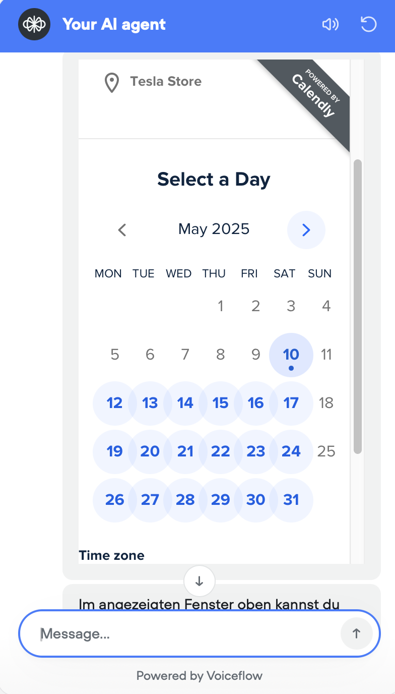
5. Zuletzt wird die Kundschaft gefragt, ob sie einen Termin vereinbaren konnten, sollte dies so sein, ist der Workflow beendet, falls nicht, können sie wählen, ob sie entweder an einen Menschen weitergeleitet werden möchte oder ob sie es erneut probieren möchten.

In diesem Workflow wurde bewusst darauf verzichtet eine Bestätigungsmail von Tesla zu versenden, da eine Mail von Calendly versendet wird, sowohl an die Kundschaft, als auch an Tesla selber.
Am Ende werden zusätzlich die Kundendaten in einem Google Sheets gespeichert, sodass Tesla die Daten bereits hat, sollte sich ein Kunde entscheiden, dort dann ein Konto zu eröffnen.
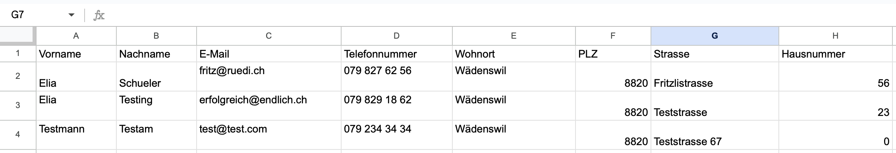

### Workflow Spezifische Frage

Hier kann die Kundschaft spezifische Fragen zu den Modellen stellen. Die Fragen werden durch ein LLM mithilfe der Knowledge Base beantwortet.
Ablauf:
1. Die Kundschaft erreicht diesen Workflow entweder über den Intent, indem eine Frage gestellt wurde wie "Wie viel kostet ein Model X?" oder sie wurden durch den Workflow Modellberatung hierhergeleitet, in diesem Fall startet der Workflow beim Block "Spezifische_Frage_Start". 
2. Die Frage befindet sich immer in last_utterance, zuerst wird die Frage, falls nötig durch ein LLM umformuliert, um diese später einfacher durch die Knowledge Base beantworten zu können. Für die Umformulierung wurde hier bewusst auf ein sehr kleines Modell, GPT-4o mini gesetzt, da dies eine relativ simple Aufgabe ist. Hier wurde Few-Shot Learning genutzt, um dem Modell zu zeigen, wie es Fragen umformulieren kann und wie sie aussehen sollten.
3. Nun wird die Knowledge Base nach der Frge durchsucht. Sollten keine Antworten zur Frage gefunden werden, so wird der Kundschaft mitgeteilt, dass keine Informationen dazu gefunden wurde und sie können es entweder erneut probieren oder die Frage erneut stellen. 
4. Sofern eine Antwort gefunden wurde, beantwortet nun ein LLM die Frage der Kundschaft. Auch hier wurde erneut auf GPT-4o mini gesetzt, da es für diese Aufgabenstellung mehr als ausreicht und eine schnelle Beantwortung ermöglicht. Auch hier wurden schon einige Fragen mit Beispielantworten hinzugefügt um Few-Shot Learning zu ermöglichen.
5. Es wird gefragt, ob die Antwort die Frage beantwortet hat, falls ja, kann die Kundschaft wählen, ob sie erneut eine Frage stellen möchte, ein Modell kaufen möchte oder eine Modellberatung braucht. Falls die Antwort die Frage nicht beantwortet hat, kann entweder die Frage erneut gestellt werden oder an einen Menschen weitergeleitet werden. 

### Workflow Supportanfrage zu Mensch

Dieser Workflow ist dafür da um eine Anfrage an einen Menschen weiterzuleiten, sei es eine fehlgeschlagene Termivereinbarung oder eine sehr spezifische Frage. Er ist der Back-Up Workflow, falls irgendwo der Chatbot der Kundschaft nicht mehr helfen kann. Dieser Workflow wird nicht am Start und an anderen Orten als Funktionalität vermarktet, da möglichst viele Anfragen über unseren Chatbot beantwortet werden sollen.
Ablauf:
1. Die Kundschaft erreicht diesen Workflow über einen Intent, der darauf hört, wenn die Kundschaft erwähnt, dass man mit einem Kunden sprechen möchte oder sie wurden von anderen Workflows weitergeleitet, weil sie nicht mehr weiterkamen. 
2. Die Kundschaft wird nochmals aufgefordert ihre Frage mitzuteilen, diese wird dann in einer entsprechenden Variabel gespeichert. 
3. Die Kundschaft wird gefragt, wie sie kontaktiert werden will, dies ist später nützlich für die Support-Mitarbeiter um die Kunden auf dem gewünschten Wege zu erreichen. 
4. Danach werden einige persönliche Angaben erfragt, nachdem diese über Entities befüllt wurden, wird der Kunde nochmals gefragt, ob diese so richitg sind, falls nicht, wird die Kundschaft erneut nach den Angaben gefragt. 
5. Sobald alle persönlichen Angaben gemäss dem Kunden korrekt sind, werden alle gespeicherten Variablen wie Kontaktform, persönliche Informationen und die Frage an einen Webhook von Make.com gesendet. Dort wird eine Bestäigunsmail an die angegebene E-Mail versendet. Zudem erhält das Support Team (In dem fall eine Gruppe von uns Studenten) eine Nachricht auf Telgram, dass es eine neue Frage gibt, von wem sie ist und wo die Kundschaft kontaktiert werden möchte. 
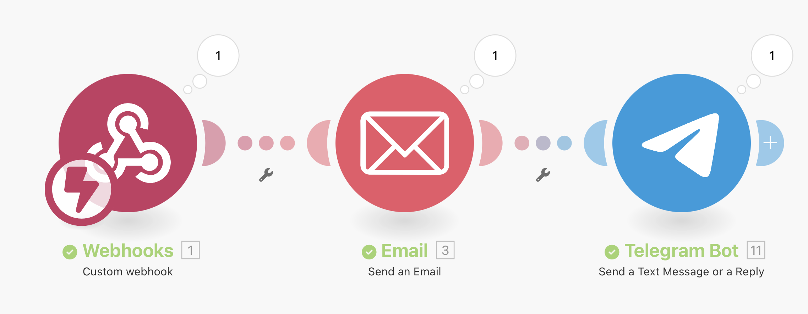
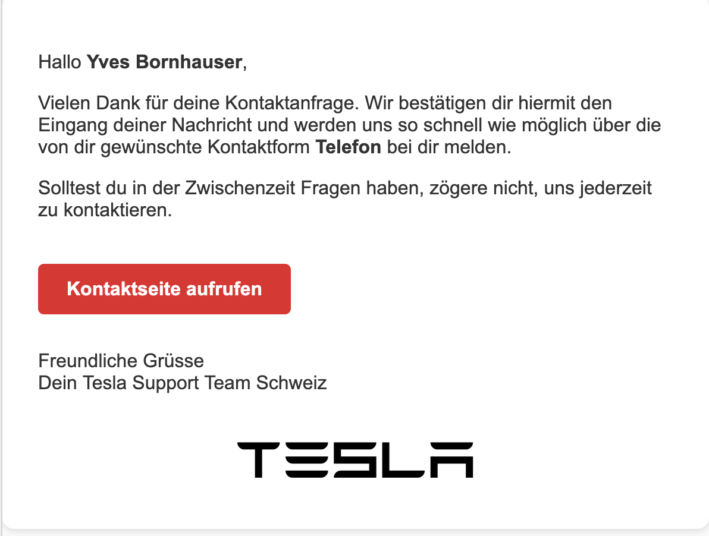
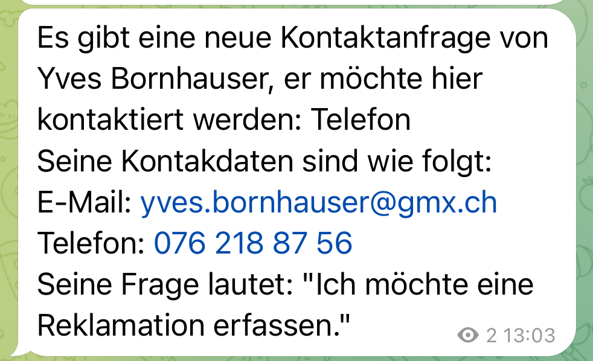

## Knowledge Base auf Voiceflow

Die Knowledge Base ist der Ort, wo Informationen zu den verschiedenen Tesla Modellen gespeichert werden. Auf diese Informationen wird beim Workflow "Spezifische Frage" mit RAG zugegriffen. Alle Quellen die dort eingefügt wurden, wurden von uns auf Richtigkeit überprüft um eine hohe Antwortqualität zu gewährleisten. Es wurde zudem ein FAQ hinzugefügt um häufige generelle Fragen beantworten zu können. Für die Knowledge Base wurde bewusst auf GPT-4o gesetzt um Fragen richtig und vollständig beantworten zu können, bzw. die richtigen Informationen zu finden.

## Transparenzhinweise

- Für die Erstellung von gewissen Nachrichten wurde auf Chatpgt zurückgegriffen um möglichst bot-ähnliche Nachrichten zu simulieren
- Für die Erstellung der HTML Mails wurde Chatgpt zur Unterstützung genutzt, da wir uns damit leider nicht sehr gut auskennen
- Für die Erstellung der Canva Website und der HTML Datei wurde Chatgpt genutzt

### Team

- Yves Bornhauser
- Haris Salii
- Elia Geromin

